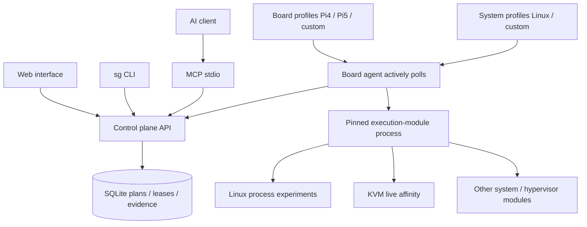

# Side Galaxy Technical Research and Work Plan

Research date: 2026-09-26. Confirmed: Raspberry Pi 4 / Pi 5 as the initial boards, Linux + KVM, one server managing multiple boards, Web / CLI / MCP, extensible board and system modules, and management-module hot reload. Board connection details, kernel configuration, libvirt version, and VM images are not currently available.

## Define Reboot-Free Operation First

"No board reboot required" can mean a persistent management plane, experiments running in processes or guests, online changes to dynamically configurable resources, and restoration after experiments. It does not mean every parameter supports hot updates or that recovery will never require a reboot.

| Change | Usually Avoids a Whole-Board Reboot | Required Work |
|---|---|---|
| Experiment programs and module source | Yes | Separate processes, content-addressed versions, and switching at idle boundaries |
| Experiment process affinity / resource limits | Yes | Affinity / cgroup v2, permission checks, and verified restoration |
| KVM vCPU affinity | Yes | libvirt live configuration and snapshot restoration, with reserved management cores |
| Guest programs or guest recreation | Depends on the scenario | Guest agent / image mechanisms; distinguish guest reboots from whole-board reboots |
| Memory hotplug and device passthrough | Conditional support | Guest, host, device, and IOMMU support; universal hot switching cannot be promised |
| Kernel / hypervisor / boot parameters | Often requires a reboot | Use explicit maintenance windows rather than presenting these as experiment hot reloads |

KVM provides the kernel virtualization interface; libvirt handles higher-level lifecycle management and tuning, avoiding a reimplementation of complex KVM ioctl management. libvirt supports vCPU, emulator, and I/O thread pinning, plus host-dependent cachetune / memorytune. See the [KVM API](https://docs.kernel.org/virt/kvm/api.html) and [libvirt domain XML](https://libvirt.org/formatdomain.html). The first version implements live vCPU affinity experiments, not complete VM lifecycle management.

## Shared Resources Extend Beyond CPU Cores

Distinguish resource observation, scheduling, limiting, and strong isolation. CPU affinity only restricts where tasks can run; it does not exclude interference from other host processes, IRQs, emulator threads, or DMA.

| Resource | Management Measures | Evidence and Limitations |
|---|---|---|
| Physical cores / vCPUs | Affinity, cpuset, reserved management cores, and CPU hotplug when needed | Record online cores, actual pinning, and IRQ/emulator placement |
| Memory capacity / NUMA | cgroup memory.max, NUMA policy, hugepages | Separate guest memory from QEMU overhead; RLIMIT_AS only limits process address space |
| Shared cache | resctrl / CAT / MPAM when supported | Without hardware support, only measure and orchestrate interference; cache-way partitioning is unavailable |
| DRAM bandwidth | MBA / MPAM when supported; measure bandwidth contention | Capacity limits are not bandwidth limits; percentages and MB/s are not interchangeable |
| I/O / DMA / interrupts | I/O weights, exclusive device ownership, IRQ affinity, IOMMU | Device reset capabilities and isolation groups affect failure recovery |
| Thermal state / frequency / power | Temperature and throttling observation, frequency policies, cooling baselines | Thermal throttling can change results even under the same workload |

The [official cgroup v2 documentation](https://docs.kernel.org/admin-guide/cgroup-v2.html) defines CPU, memory, I/O, and other controllers. The first version does not claim cgroup support as implemented: the Linux module uses unprivileged affinity and RLIMIT_AS; cgroup delegation will require a controlled helper later.

The [Linux MPAM documentation](https://docs.kernel.org/arch/arm64/mpam.html) requires support from the CPU, memory-system components, and firmware descriptions, with topology restrictions in resctrl. ARM64 alone does not establish MPAM availability. The initial Pi 4 / Pi 5 capability lists do not claim cache partitioning or DRAM bandwidth control; those requests are rejected directly.

## Pi 4 and Pi 5

The [official Pi 4 specifications](https://www.raspberrypi.com/products/raspberry-pi-4-model-b/specifications/) describe the BCM2711 and quad-core Cortex-A72; the [official Pi 5 specifications](https://www.raspberrypi.com/products/raspberry-pi-5/) describe the BCM2712 and quad-core Cortex-A76, with per-core L2 and shared L3. They should have separate board profiles; memory capacity, available CPUs, and runtime capabilities are discovered by the agent rather than hard-coded from model names.

The first hardware pass should collect the distribution/kernel version, 64-bit userspace, `/dev/kvm`, KVM modules, libvirt URI and permissions, guest architecture and UUID, CPU topology, current VM pinning, temperature/throttling state, IOMMU, and available counters. Product specifications are not evidence of the current kernel configuration.

## Using Existing Tools

| Project | Suitable Problems | Role in Side Galaxy |
|---|---|---|
| labgrid | Lab device access, serial ports, power, and exclusive reservations | Later integration with underlying resources; avoid rewriting every flashing/power driver |
| LAVA | System deployment, boot tests, distributed workers, multi-node tests, and results | Later integration with existing test infrastructure |
| libvirt / KVM | VM runtime management and resource tuning | Preferred execution backend for the current Linux + KVM direction |
| Jailhouse | Static partitioning and cell lifecycle | A potential separate backend; KVM's dynamic semantics do not apply |
| Xen | Domains, CPU pools, and vCPU pinning | A potential separate backend, integrated according to its capabilities |

The [labgrid architecture](https://github.com/labgrid-project/labgrid/blob/master/doc/overview.rst) uses coordinator / exporter / client components and mutually exclusive places. Side Galaxy borrows the resource-reservation concept, but its first version uses simple per-board leases instead of adding the full labgrid dependency.

[LAVA features](https://docs.lavasoftware.org/lava/introduction/features.html) include centralized services, distributed workers, parallel execution, and MultiNode jobs. It covers much of the basic work of a lab; Side Galaxy focuses on runtime multicore resource plans and AI access rather than rebuilding a complete firmware CI system.

[Jailhouse](https://github.com/siemens/jailhouse) is a partitioning hypervisor; [Xen xl](https://xenbits.xen.org/docs/unstable/man/xl.1.html) provides management commands such as cpupool. They are comparison points and have not been implemented or verified in the first version.

## Architecture and Module Boundaries

Board profiles contain hardware knowledge; system profiles select runtime requirements and execution modules; resource modules declare capabilities through the protocol; experiment templates are sets of capabilities published by modules. The control plane does not derive resource functions from model names. New profiles require no control-plane changes; custom execution modules may select new mode and template names. Current plan fields cover CPU/interference CPU/memory/duration/optional bandwidth. New device parameters require upgrading the versioned protocol rather than bypassing it with arbitrary shell fields.

Module hot reload means validating a new immutable snapshot and using it for subsequent tasks, not calling importlib.reload on running Python objects. A pinned version includes source, board profiles, and system profiles. Module failure keeps the previous version; queued tasks whose version has changed fail and require new preflight. Subprocesses provide fault isolation, not a sandbox for malicious code.

## Phased Work and Acceptance

| Phase | Required Work | Acceptance Criteria |
|---|---|---|
| 0: Protocol and control plane | Board registration, roles, heartbeats, capabilities, atomic admission, leases, evidence, CLI/MCP/Web | Complete synthetic multi-board workflow; concurrency/cancellation/disconnection/reload tests |
| 1: Pi4 / Pi5 integration | Actual Linux environment, agent deployment, resource discovery, KVM permissions, selected VMs | Run on both boards and record unchanged boot IDs, results, and resource restoration |
| 2: Controlled experiments | Guest workloads, victim/interferer, cgroup, PMU, frequency/thermal state | Baseline/interference/control A/B comparisons with reproducible plans and outputs |
| 3: Resource isolation | Emulator/IRQ, I/O, DMA, hardware-dependent resctrl | Explicitly reject insufficient capabilities; quarantine failed restoration; do not conflate this with strong isolation |
| 4: Reliability and scale | Network loss, agent crashes, server restarts, hang recovery, metrics, and alerts | Fault injection, retained evidence, and no automatic replay of tasks with unknown state |
| 5: Production readiness | TLS, per-board certificates, token rotation, RBAC, artifact signing, audit retention, multi-tenancy | Threat modeling, authorization and audit verification; discuss HA and database upgrades afterward |

"One-click deployment" covers two operations: deploying agents/modules to multiple boards, and submitting one experiment to registered boards. This version provides an Ansible playbook and atomic batch API, respectively. Different boards do not start with real-time synchronization; synchronized sampling, barriers, and deterministic timing need a separate protocol that accounts for clock error.

## AI Interface

The official [MCP Python SDK](https://github.com/modelcontextprotocol/python-sdk) handles the MCP protocol, using the maintained v1 branch pinned to `<2`. Only read and preflight tools are exposed by default; writes require `--allow-writes` and a server operator token. AI can submit only structured plans; no SSH shell, remote module source, firmware flashing, or whole-board reboot tools are exposed.

[OpenSpec](https://github.com/Fission-AI/OpenSpec) tracks requirements and changes; [Ponytail](https://github.com/DietrichGebert/ponytail) guides reuse of the standard library and existing components. The first version chooses a single service, SQLite, and a native frontend; queues and PostgreSQL can follow when actual scale exceeds one node.
