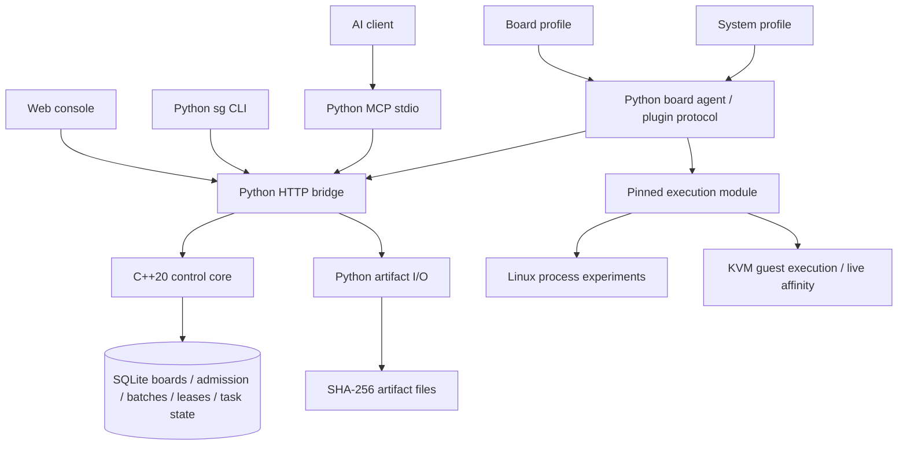

# Side Galaxy Architecture and Resource Model

Side Galaxy consists of a C++20 control core, Python interface and execution bridges, board/system profiles, and execution modules. The control core uses SQLite to store and manage boards, capability admission, atomic batches, leases, and task state; Python handles HTTP / CLI / MCP, artifact file I/O, and the execution-plugin protocol.

Board agents actively poll for tasks and invoke pinned execution-module versions on target devices. The native core is required; a missing or unloadable native library produces an error rather than switching to a Python scheduler.

## Service Flow

Scheduling requests from Web, CLI, and MCP enter the same native core. Within a SQLite transaction, C++ checks every target's capabilities, resources, and occupancy before creating a batch and per-board leases; Python does not duplicate scheduling rules. Each board holds at most one experiment lease. Once the agent returns execution and cleanup results, the core handles terminal state and resource release. Unknown execution state triggers quarantine to prevent new experiments from starting on a board that may still be running a workload.

Python retains network interfaces, authentication integration, request serialization, artifact transfer, and plugin invocation. Execution modules discover and report resource capabilities; the C++ core decides admission, occupancy, and task transitions. See the [native build guide](native-build.md) for compilation and shared-library installation.

Multi-board deployment and experiments use the Ansible playbook and batch API, respectively. Boards begin execution independently; synchronized sampling requires the experiment's own clock and barrier protocol.

## Online Resource Changes

The management agent stays running while experiments run in separate processes or guests. Program updates, module hot reloads, and live vCPU affinity changes can occur on a running system; kernel, hypervisor, and boot-parameter changes require maintenance according to the system's requirements.

| Operation | Execution |
|---|---|
| Replace an experiment program | Upload a new content-addressed ZIP; later tasks reference its new digest |
| Update a management module | Validate the source snapshot and switch while the agent is idle |
| Pin Linux experiment processes | Set CPU affinity, inherited by child processes |
| Budget Linux process memory | Set `RLIMIT_AS` to limit each process's virtual address space |
| Pin KVM vCPUs | Save live affinity, apply the experiment configuration, and restore it afterward |
| Run KVM guest experiments | Distribute and execute the bundle through QEMU Guest Agent, then clean up the working directory after the task |

The KVM module operates on running VMs selected by the administrator; VM creation, image updates, memory hotplug, and device passthrough belong to external virtualization-management workflows. KVM provides the kernel virtualization interface, while libvirt manages domain configuration and runtime state; see the [KVM API](https://docs.kernel.org/virt/kvm/api.html) and [libvirt domain XML](https://libvirt.org/formatdomain.html).

## Multicore Shared Resources

CPU affinity only restricts which cores a task may run on. Other host processes, interrupts, emulator threads, and DMA may still contend for resources. The Linux module uses affinity and `RLIMIT_AS`; the KVM module manages live vCPU affinity while leaving VM memory configuration unchanged.

The following table guides resource-extension module design; actual plans must satisfy the capabilities reported by the agent.

| Resource | Linux / Virtualization Mechanism | Configuration Considerations |
|---|---|---|
| Physical cores / vCPUs | Affinity, cpuset, reserved management cores | Distinguish workload, IRQ, emulator, and I/O thread placement |
| Memory capacity / NUMA | cgroup memory.max, NUMA policy, hugepages | Separate guest memory from QEMU overhead; RLIMIT_AS limits process address space |
| Shared cache | resctrl / CAT / MPAM when supported by hardware | Configure according to actual cache topology and hardware partitioning capabilities |
| DRAM bandwidth | MBA / MPAM when supported by hardware | Capacity limits are not bandwidth limits; percentages and MB/s have different meanings |
| I/O / DMA / interrupts | I/O weights, exclusive device ownership, IRQ affinity, IOMMU | Device reset capabilities and isolation groups affect resource recovery |
| Temperature / frequency / power | Temperature and throttling observation, frequency policies | Thermal throttling may produce different results under the same workload |

[cgroup v2](https://docs.kernel.org/admin-guide/cgroup-v2.html) defines CPU, memory, I/O, and other controllers; integration must handle permissions and delegation. [ARM MPAM](https://docs.kernel.org/arch/arm64/mpam.html) depends on CPU support, memory-system components, and firmware descriptions, and cannot be enabled merely because the architecture is ARM64. Built-in execution modules do not advertise cache partitioning or DRAM bandwidth control, so preflight rejects those requests.

## Boards, Systems, and Modules

Board profiles describe hardware; system profiles select runtime requirements and modules; execution modules publish capabilities and templates through the protocol. The control plane admits work based on agent discovery, not model names. New device-resource parameters require extending the plan protocol; experiment arguments and environment variables travel with the artifact plan.

The [official Pi 4 specifications](https://www.raspberrypi.com/products/raspberry-pi-4-model-b/specifications/) list the BCM2711 and quad-core Cortex-A72; the [official Pi 5 specifications](https://www.raspberrypi.com/products/raspberry-pi-5/) list the BCM2712 and quad-core Cortex-A76. They use separate board profiles; the agent discovers available CPUs, memory capacity, and runtime capabilities.

When configuring a device, check the distribution and kernel, 64-bit userspace, `/dev/kvm`, libvirt URI and permissions, guest architecture and UUID, CPU topology, and VM pinning. Resource experiments should also record temperature, throttling state, and counter configuration to support comparisons across repeated runs.

Hot reload validates an immutable snapshot before using it for later tasks; running tasks keep their implementation. The snapshot digest covers the module, runner, board profile, and system description. Invalid modules leave the previous snapshot active; queued tasks whose version has changed require a new preflight. See [module development and hot reload](modules.md) for protocol details.

## Related Tools

| Tool | Main Use | Reference |
|---|---|---|
| labgrid | Serial ports, power, lab device resources, and mutually exclusive reservations | [Coordinator / exporter / client architecture](https://github.com/labgrid-project/labgrid/blob/master/doc/overview.rst) |
| LAVA | System deployment, boot tests, distributed workers, and multi-node jobs | [Feature overview](https://docs.lavasoftware.org/lava/introduction/features.html) |
| libvirt / KVM | VM runtime state, resource configuration, and guest operations | [Domain configuration](https://libvirt.org/formatdomain.html) |
| Jailhouse | Static partitioning and cell lifecycle | [Project documentation](https://github.com/siemens/jailhouse) |
| Xen | Domains, CPU pools, and vCPU pinning | [xl commands](https://xenbits.xen.org/docs/unstable/man/xl.1.html) |

Side Galaxy's KVM execution module uses libvirt. Other tools can inform module design or lab integration; each hypervisor's lifecycle and resource semantics should be handled by its own module.

## AI Interface

MCP integration uses the official [Python SDK](https://github.com/modelcontextprotocol/python-sdk). Queries and preflight are enabled by default; write tools require an explicit `--allow-writes` flag and an operator token.

AI submits structured experiment plans and ZIP artifacts, and the control plane checks targets and resources using the same rules. Administrators deploy management modules on boards; MCP does not expose SSH shells, remote management-module source replacement, firmware flashing, or whole-board reboot tools. See [operations, deployment, and AI integration](operations.md) for configuration.
